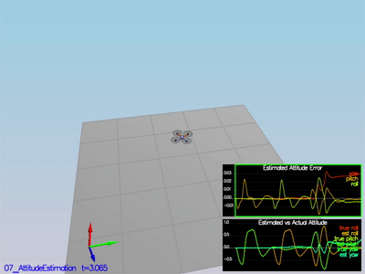

# Estimation


## Step 1: Sensor Noise 


<p align="center">

</p>


- Calculated standard diviations of the sensors (see Jupyter Notebook)
    - GPS: 0.718
    - IMU: 0.495


```
PASS: ABS(Quad.GPS.X-Quad.Pos.X) was less than MeasuredStdDev_GPSPosXY for 71% of the time
PASS: ABS(Quad.IMU.AX-0.000000) was less than MeasuredStdDev_AccelXY for 68% of the time
```


## Step 2: Attitude Estimation


<p align="center">

</p>

- Used nonlinear complementary filter for estimating attitude
    -  phi and theta are estimated
    - Accerometer and Rate Gyro are used as the complementary sensors 
    - converted p, q, r values of body frame from gyroscope, to pitch and roll using rotation matrix


```
PASS: ABS(Quad.Est.E.MaxEuler) was less than 0.100000 for at least 3.000000 seconds
```


## Step 3: Prediction Step


<p align="center">

</p>

```
PASS: ABS(Quad.Est.E.MaxEuler) was less than 0.100000 for at least 3.000000 seconds
```

## Step 4: Magnetometer Update


<p align="center">

</p>

```
PASS: ABS(Quad.Est.E.Yaw) was less than 0.120000 for at least 10.000000 seconds
PASS: ABS(Quad.Est.E.Yaw-0.000000) was less than Quad.Est.S.Yaw for 77% of the time
```

## Step 5: Closed Loop + GPS Update


<p align="center">

</p>

```
PASS: ABS(Quad.Est.E.Pos) was less than 1.000000 for at least 20.000000 seconds
```